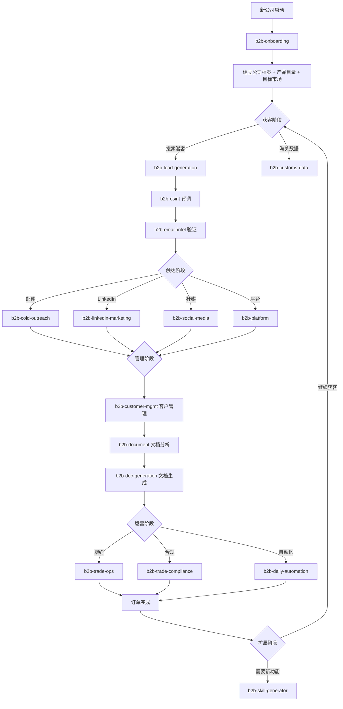
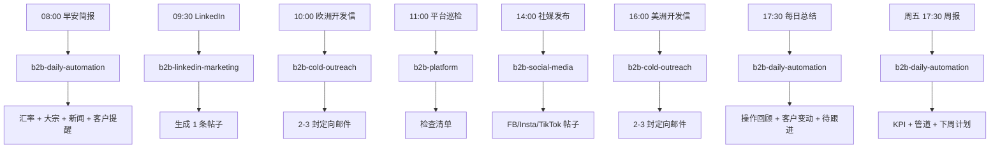
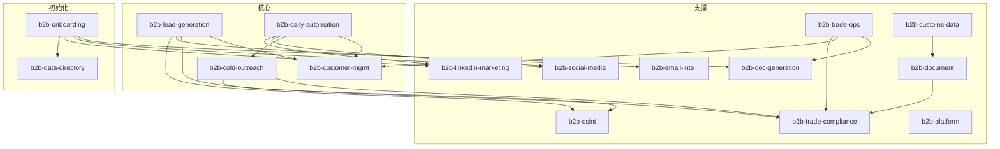

# B2B Skills 流程图

> Mermaid 流程图，可直接渲染

---

## 整体业务流程

```mermaid
flowchart TD
    A[新公司启动] --> B[b2b-onboarding]
    B --> C[建立公司档案 + 产品目录 + 目标市场]
    
    C --> D{获客阶段}
    D -->|搜索潜客| E[b2b-lead-generation]
    D -->|海关数据| F[b2b-customs-data]
    
    E --> G[b2b-osint 背调]
    G --> H[b2b-email-intel 验证]
    
    H --> I{触达阶段}
    I -->|邮件| J[b2b-cold-outreach]
    I -->|LinkedIn| K[b2b-linkedin-marketing]
    I -->|社媒| L[b2b-social-media]
    I -->|平台| M[b2b-platform]
    
    J --> N{管理阶段}
    K --> N
    L --> N
    M --> N
    
    N --> O[b2b-customer-mgmt 客户管理]
    O --> P[b2b-document 文档分析]
    P --> Q[b2b-doc-generation 文档生成]
    
    Q --> R{运营阶段}
    R -->|履约| S[b2b-trade-ops]
    R -->|合规| T[b2b-trade-compliance]
    R -->|自动化| U[b2b-daily-automation]
    
    S --> V[订单完成]
    T --> V
    U --> V
    
    V --> W{扩展阶段}
    W -->|需要新功能| X[b2b-skill-generator]
    W -->|继续获客| D
```

## 客户开发详细流程

```mermaid
flowchart LR
    A[发现潜客] --> B{来源}
    B -->|三通道搜索| C[b2b-lead-generation]
    B -->|海关数据| D[b2b-customs-data]
    
    C --> E[候选客户列表]
    D --> E
    
    E --> F[b2b-osint 背调]
    F --> G[风险评级 + 采购偏好]
    
    G --> H{是否值得开发?}
    H -->|是| I[b2b-email-intel 邮箱验证]
    H -->|否| J[归档]
    
    I --> K[真实性评分]
    K --> L[b2b-cold-outreach 写开发信]
    
    L --> M[个性化邮件 + 主题行变体]
    M --> N[b2b-trade-compliance 合规检查]
    N --> O[发送]
    
    O --> P[b2b-lead-generation 跟进序列]
    P --> Q[Day 3/7/14/30 自动跟进]
    
    Q --> R{客户回复?}
    R -->|是| S[b2b-customer-mgmt 录入]
    R -->|否| T[归档]
    
    S --> U[b2b-doc-generation 报价单]
    U --> V[b2b-trade-ops 谈判/履约]
```

## 日常自动化流程

```mermaid
flowchart TD
    A[08:00 早安简报] --> B[b2b-daily-automation]
    B --> C[汇率 + 大宗 + 新闻 + 客户提醒]
    
    D[09:30 LinkedIn] --> E[b2b-linkedin-marketing]
    E --> F[生成 1 条帖子]
    
    G[10:00 欧洲开发信] --> H[b2b-cold-outreach]
    H --> I[2-3 封定向邮件]
    
    J[11:00 平台巡检] --> K[b2b-platform]
    K --> L[检查清单]
    
    M[14:00 社媒发布] --> N[b2b-social-media]
    N --> O[FB/Insta/TikTok 帖子]
    
    P[16:00 美洲开发信] --> Q[b2b-cold-outreach]
    Q --> R[2-3 封定向邮件]
    
    S[17:30 每日总结] --> T[b2b-daily-automation]
    T --> U[操作回顾 + 客户变动 + 待跟进]
    
    V[周五 17:30 周报] --> W[b2b-daily-automation]
    W --> X[KPI + 管道 + 下周计划]
```

## 售后运营流程

```mermaid
flowchart LR
    A[订单确认] --> B[b2b-customer-mgmt 创建订单]
    B --> C[生产中]
    C --> D[b2b-trade-ops 进度更新]
    D --> E[发货]
    E --> F{物流正常?}
    F -->|是| G[到货]
    F -->|异常| H[b2b-trade-ops 物流异常处理]
    H --> G
    G --> I[b2b-trade-ops 售后维护 第7天]
    I --> J[b2b-trade-ops 满意度调查]
    J --> K{有问题?}
    K -->|是| L[b2b-trade-ops 索赔处理]
    L --> M[b2b-trade-compliance 合规检查]
    M --> N[解决方案]
    K -->|否| O[回款]
    O --> P[b2b-trade-ops 催款]
    P --> Q{按时付款?}
    Q -->|否| R[b2b-trade-ops 二次催付 + 折中方案]
    Q -->|是| S[年度总结]
    R --> S
    S --> T[b2b-trade-ops 年度合作总结]
    T --> U[节日问候]
    U --> V[b2b-trade-compliance 文化禁忌检查]
    V --> W[发送]
```

## Skill 依赖关系

```mermaid
graph TD
    subgraph 核心
        A[b2b-lead-generation]
        B[b2b-customer-mgmt]
        C[b2b-cold-outreach]
        D[b2b-daily-automation]
    end
    
    subgraph 支撑
        E[b2b-osint]
        F[b2b-email-intel]
        G[b2b-trade-compliance]
        H[b2b-document]
        I[b2b-doc-generation]
        J[b2b-trade-ops]
        K[b2b-linkedin-marketing]
        L[b2b-social-media]
        M[b2b-platform]
        N[b2b-customs-data]
    end
    
    subgraph 初始化
        O[b2b-onboarding]
        P[b2b-data-directory]
    end
    
    A --> E
    A --> F
    A --> G
    A --> B
    C --> E
    C --> G
    D --> K
    D --> L
    D --> C
    D --> B
    O --> P
    O --> K
    O --> L
    O --> I
    H --> G
    J --> G
    J --> B
    J --> I
    N --> H
```
